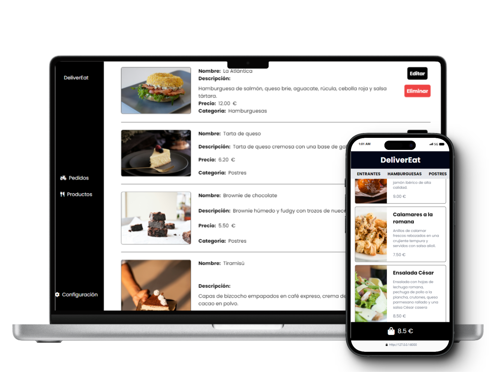

## Sobre el proyecto

DeliverEat es un software en la web desarrollado con Laravel en monolito que permite a los restaurantes gestionar y recibir pedidos a domicilio. La idea principal es crear una aplicación sencilla de usar e intuitiva que no requiera de formación previa tanto para el administrador como para los usuarios.

## Tecnologías utilizadas

*Laravel 11.0
*TailwindCSS 3.4.3
*Stripe
*MySql

## Para iniciar el proyecto

1. Descarga el repositorio
2. Configura en el archivo .env
3. Ejecuta los siguientes comandos
   ```
    php artisan migrate
    npm install
    npm run dev
    php artisan serve
    ```



